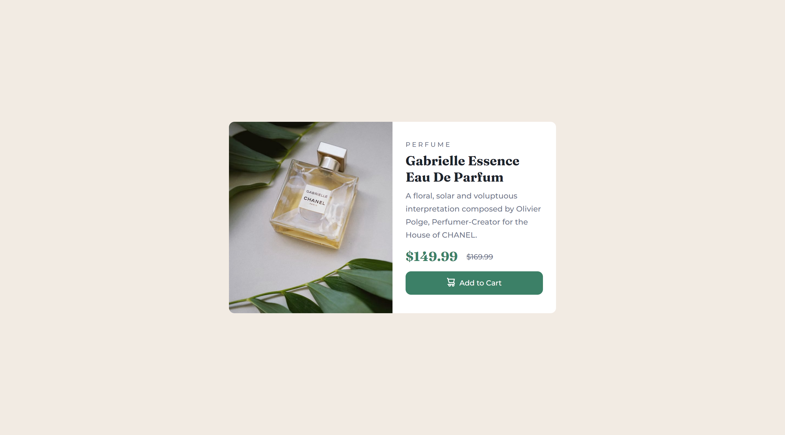

# Frontend Mentor - Order summary card solution

This is a solution to the [Product preview card component challenge on Frontend Mentor](https://www.frontendmentor.io/challenges/order-summary-component-QlPmajDUj). 

### Screenshot

### Links

- Live Site URL: [Add live site URL here](https://197naveen.github.io/product-preview-card-component/index.html)

### Built with

- HTML5
- CSS custom properties
- CSS root element and variables
- Flexbox
- Mobile-first workflow
- Desktop workflow

### What I learned

In this project i learned how to use root and css variable properties. From designing perspective, i understand why mobile first design is needed. Mobile first design is an easy design and the gradually scale to desktop design. 
